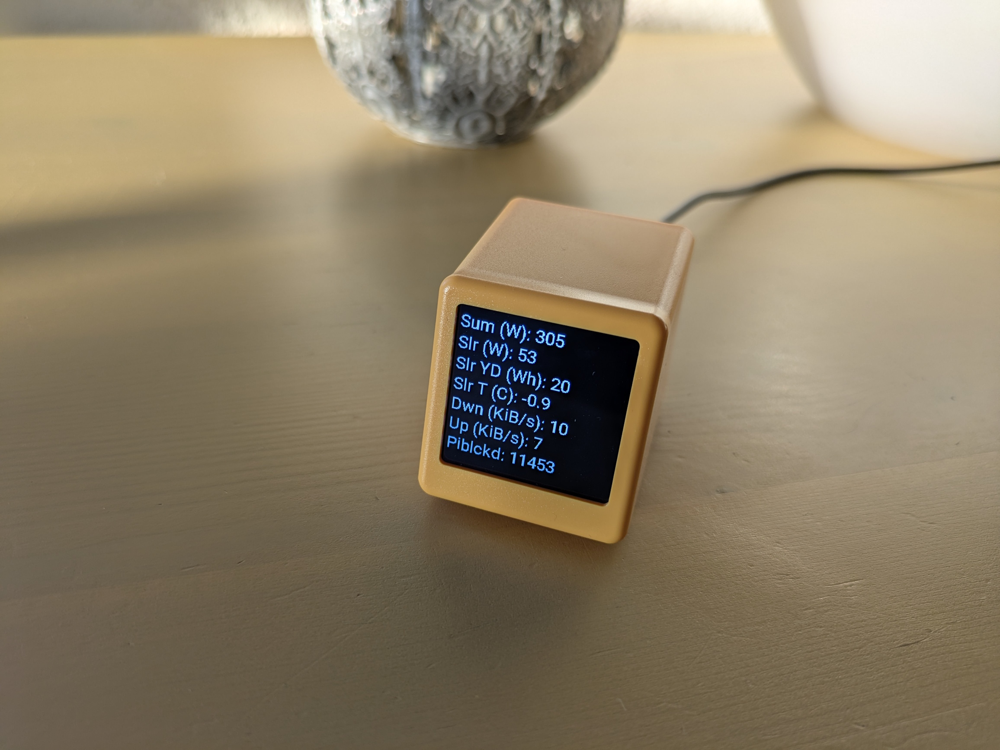
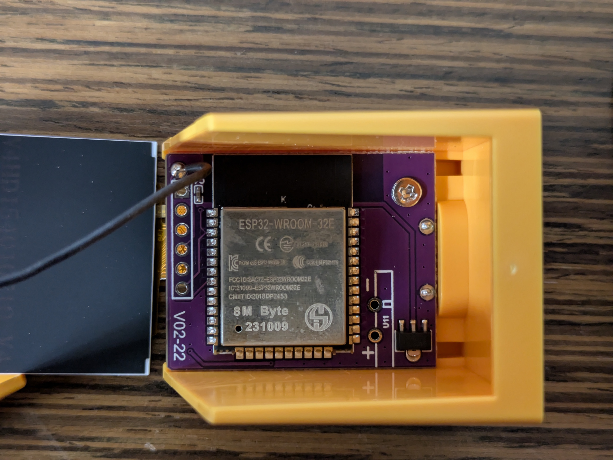
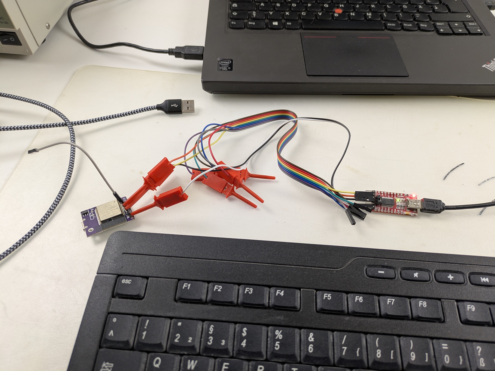

# Small TV Pro as an ESPHome node

## Description

Use the GeekMagic Small TV Pro as an [ESPHome](https://esphome.io/) node to display HA sensor values. 

This work is based on a [thread](https://community.home-assistant.io/t/installing-esphome-on-geekmagic-smart-weather-clock-smalltv-pro/618029) on the home assistant forums.

When using this repo as is, your device will look like this:



## The fine print ...

* The goal here is to replace the original firmware entirely by [ESPHome](https://esphome.io/).
* ESPHome is like a framework to transform ESP32-based devices to Home Assistant "nodes", like displays, sensors and/or actors.
    * ESPHome is configured via yaml files
    * It will compile a firmware which is then flashed via serial or OTA onto the device.
* ESPHome itself must initially be flashed via serial onto the device. After that, it will offer an easy to use OTA update functionality.
* Make sure you have a "small tv pro" not a "small tv".





## Step by step

* Open the device (careful with the display)
* Solder standard pin headers unto the board.
    * Do this at an angle, so it fits into the case afterwards.
* Connect a serial converter set to 3.3V
    * Make sure you set the voltage beforehand. Otherwise magic smoke may be released from the SoC.
* Go to [https://web.esphome.io/] and us the web flasher to make your initial flash of ESPHome.
* When successful, switch to an esphome IDE. I've been using the docker image and the "web editor" like this
    * ```docker run --rm --net=host -v "${PWD}":/config -it ghcr.io/esphome/esphome```
* Switch to the "web editor" and paste the code from this repo. 
* Make sure to register the node in home assistant which gives you an encryption key.
